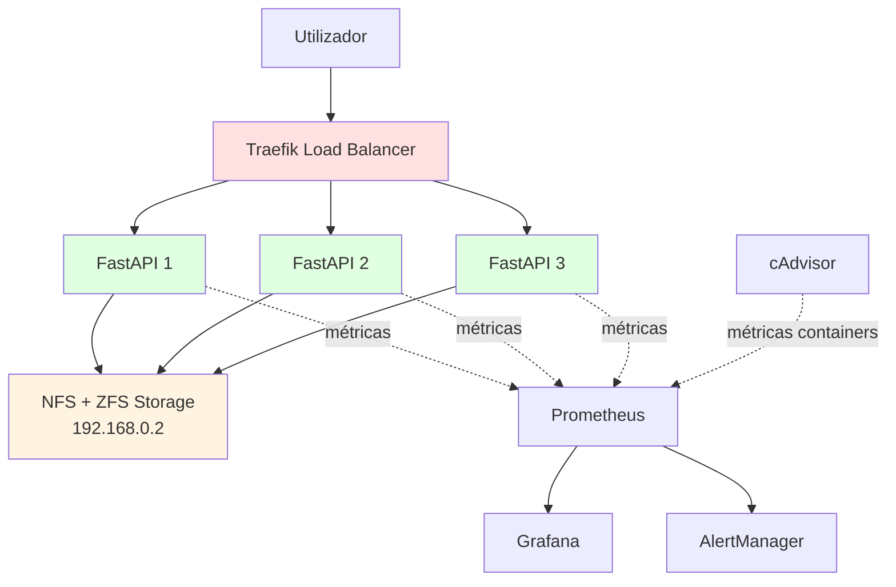

# UM Drive

Sistema de armazenamento distribuído com REST API, desenvolvido para a UC de Infraestruturas e Tecnologias de Informação (ITI).

**Mestrado em Engenharia e Gestão de Sistemas de Informação**  
Universidade do Minho | 2025

---

## Arquitetura



**Stack:**
- 3 réplicas FastAPI (CRUD API)
- Traefik (load balancer dinâmico)
- NFS + ZFS (armazenamento partilhado)
- Prometheus + Grafana + cAdvisor (monitorização)
- AlertManager (sistema de alertas)

---

## Início Rápido

### Infraestrutura
- 2 VMs Ubuntu Server 24.04
- VM1 (192.168.0.2): Servidor NFS + ZFS
- VM2 (192.168.0.3): UM Drive + Monitorização

### Deployment
```bash
# VM2
git clone <repo-url>
cd um-drive
docker-compose up -d
```

Ver [docs/4_Deployment.md](docs/4_Deployment.md) para setup completo.

---

## API

**Endpoints:**
```bash
# Upload
curl -X POST -F "file=@teste.txt" http://localhost/api/files

# Listar
curl http://localhost/api/files

# Download
curl http://localhost/api/files/{id} -o ficheiro.txt

# Atualizar
curl -X PUT -F "file=@novo.txt" http://localhost/api/files/{id}

# Eliminar
curl -X DELETE http://localhost/api/files/{id}
```

**Swagger UI:** http://localhost/docs

---

## Monitorização

| Serviço | URL | Credenciais |
|---------|-----|-------------|
| Grafana | http://localhost:3000 | admin/admin |
| Prometheus | http://localhost:9090 | - |
| Traefik Dashboard | http://localhost:8081 | - |
| cAdvisor | http://localhost:8080 | - |
| AlertManager | http://localhost:9093 | - |

**Métricas:**
- CPU/memória por container
- Request rate e latência da API
- Network/Disk I/O
- Uptime dos containers

**Alertas configurados:**
- HighCPUUsage (CPU > 80%)
- HighMemoryUsage (Memória > 500MB)
- ContainerDown (container offline)
- APIHighLatency (latência > 1s)
- APIHighErrorRate (> 5% erros 5xx)
- NoHealthyReplicas (< 2 APIs up)
- DiskSpaceNFS (storage > 80%)

---

## Estrutura

```
um-drive/
├── app/                    # Aplicação FastAPI
│   ├── api/               # Endpoints
│   ├── services/          # Lógica de negócio
│   └── models/            # Modelos Pydantic
├── docs/                  # Documentação técnica
├── scripts/               # Scripts de setup
├── docker-compose.yml     # Orquestração
├── Dockerfile
├── prometheus.yml
├── prometheus-alerts.yml
└── alertmanager.yml
```

---

## Documentação

- [1. Introdução](docs/1_Introducao.md) - Contexto e objetivos
- [2. Evolução da Infraestrutura](docs/2_Evolucao_Infraestrutura.md) - Fases de desenvolvimento
- [3. Arquitetura Técnica](docs/3_Arquitectura_Tecnica.md) - Diagramas e configurações
- [4. Deployment](docs/4_Deployment.md) - Guia de instalação
- [5. Monitorização](docs/5_Monitorizacao.md) - Stack de observabilidade
- [6. Testes](docs/6_Testes.md) - Testes funcionais e resiliência
- [7. Dashboards Grafana](docs/7_dashboards_grafana.md) - Métricas e visualizações
- [Casos de Uso](docs/use-cases.md) - Casos de uso detalhados

---

## Funcionalidades

**Distribuição:**
- 3 réplicas com load balancing
- Sticky sessions (cookies)
- Health checks automáticos
- Auto-restart dos containers

**Armazenamento:**
- NFS partilhado entre réplicas
- ZFS com compressão e snapshots
- SQLite para metadados (transações ACID)
- File locking nativo da BD

**Observabilidade:**
- Métricas de containers (cAdvisor)
- Métricas da aplicação (Prometheus Instrumentator)
- Dashboards Grafana
- Sistema de alertas

---

## Tecnologias

| Componente | Tecnologia |
|------------|------------|
| API | FastAPI 0.115 + Uvicorn |
| Load Balancer | Traefik v2.10 |
| Armazenamento | NFS + ZFS |
| Containers | Docker + Docker Compose |
| Monitorização | Prometheus + Grafana + cAdvisor |
| Alertas | AlertManager |
| VMs | Ubuntu Server 24.04 |

---

## Testes

```bash
# Verificar load balancing
for i in {1..30}; do curl -s http://localhost/ | jq -r '.instance'; done | sort | uniq -c

# Health check
curl http://localhost/api/health

# Stress test (opcional)
ab -n 1000 -c 10 http://localhost/api/health
```

Ver [docs/6_Testes.md](docs/6_Testes.md) para testes completos.

---

## Projeto Académico

**UC:** Infraestruturas e Tecnologias de Informação (ITI)  
**Curso:** Mestrado em Engenharia e Gestão de Sistemas de Informação  
**Universidade do Minho** | 2025