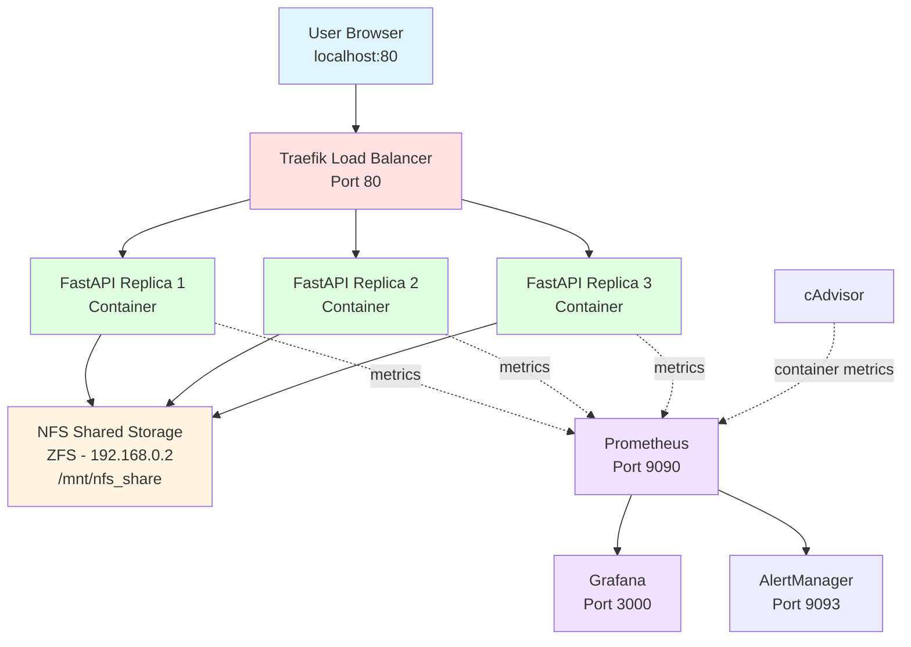
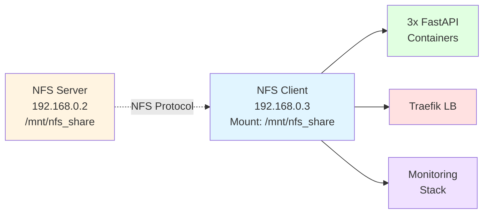

```markdown
# UM Drive - Sistema de Armazenamento Distribuído

## 1. Contexto e Objetivos

O **UM Drive** é um sistema de armazenamento de ficheiros distribuído desenvolvido como projeto final da UC de Infraestruturas e Tecnologias de Informação (ITI) da Universidade do Minho.

### Objetivos principais:
- Implementar um serviço de file storage com REST API
- Evolução de arquitetura monolítica para distribuída
- Aplicar práticas modernas: containerização, NFS, load balancing, monitorização
- Garantir escalabilidade, disponibilidade e observabilidade

---

## 2. Arquitetura Final



---

## 3. Tecnologias Utilizadas

| Componente | Tecnologia | Justificação |
|------------|------------|--------------|
| **API** | FastAPI (Python) | Performance, documentação automática (Swagger) |
| **Containerização** | Docker + Docker Compose | Isolamento, portabilidade, reprodutibilidade |
| **Load Balancer** | Traefik v2.10 | Service discovery automático, dashboard integrado |
| **Storage** | NFS + ZFS | Partilha de ficheiros, snapshots, compressão |
| **Monitorização** | cAdvisor + Prometheus + Grafana | Métricas em tempo real, alerting, visualização |
| **Virtualização** | VirtualBox (Ubuntu 24.04) | Ambiente isolado para desenvolvimento |

---

## 4. Infraestrutura

### VMs e Comunicação

**VM 1 - NFS Server**
- **IP:** 192.168.0.2
- **Função:** Storage partilhado
- **Componentes:**
  - ZFS pool (`tank/storage`)
  - Exportação NFS de `/mnt/nfs_share`
  - Backup e snapshots automáticos

**VM 2 - UM Drive Application**
- **IP:** 192.168.0.3
- **Função:** Aplicação distribuída
- **Componentes:**
  - 3 réplicas FastAPI (containers Docker)
  - Traefik load balancer
  - Stack de monitorização (cAdvisor, Prometheus, Grafana, AlertManager)
  - Cliente NFS (mount em `/mnt/nfs_share`)



---

## 5. Portas e Acessos

| Serviço | Porta | URL |
|---------|-------|-----|
| UM Drive API | 80 | http://localhost:80 |
| Traefik Dashboard | 8081 | http://localhost:8081 |
| Grafana | 3000 | http://localhost:3000 (admin/admin) |
| Prometheus | 9090 | http://localhost:9090 |
| cAdvisor | 8080 | http://localhost:8080 |
| AlertManager | 9093 | http://localhost:9093 |

---

**Curso:** Mestrado em Engenharia e Gestão de Sistemas de Informação  
**UC:** Infraestruturas e Tecnologias de Informação (ITI)
```