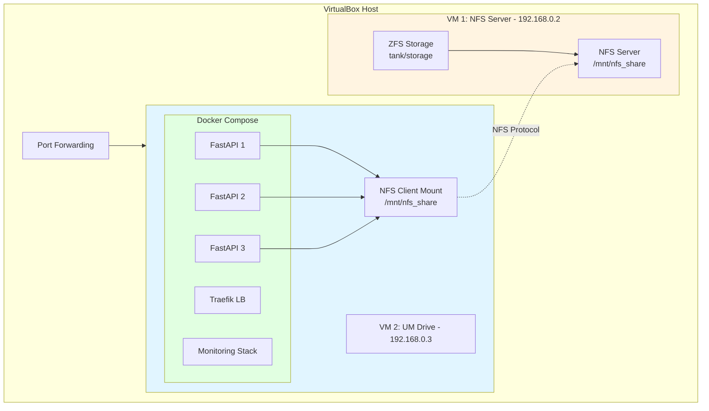
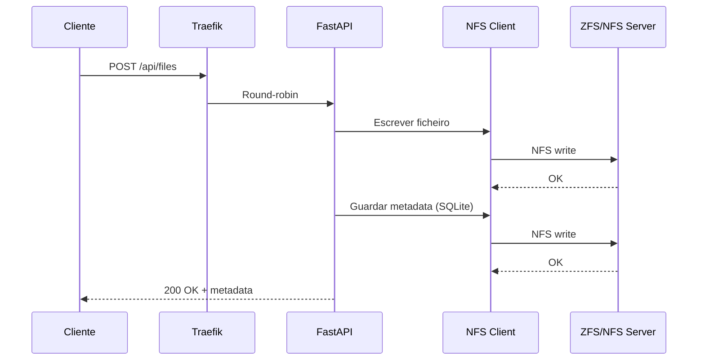
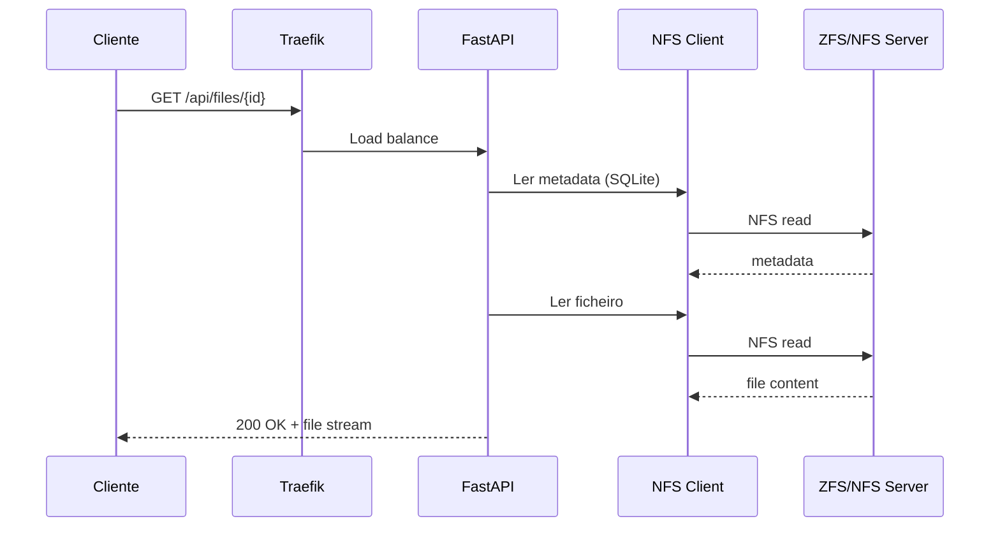

# 3. Arquitetura Técnica

## Diagrama de Rede



**Port Forwarding Host → VM2:**
- `80` → UM Drive API
- `3000` → Grafana
- `8080` → cAdvisor
- `8081` → Traefik Dashboard
- `9090` → Prometheus
- `9093` → AlertManager

---

## NFS Server (VM 192.168.0.2)

### **Configuração ZFS**
```bash
# Pool criado
sudo zpool create tank /dev/sdb

# Dataset para storage
sudo zfs create tank/storage

# Ponto de montagem
sudo zfs set mountpoint=/mnt/nfs_share tank/storage

# Propriedades
sudo zfs set compression=lz4 tank/storage
sudo zfs set atime=off tank/storage
```

### **Exportação NFS**
Ficheiro: `/etc/exports`
```
/mnt/nfs_share 192.168.0.3(rw,sync,no_subtree_check,no_root_squash)
```

### **Serviços**
```bash
sudo systemctl enable nfs-kernel-server
sudo systemctl start nfs-kernel-server
sudo exportfs -ra
```

---

## UM Drive Server (VM 192.168.0.3)

### **Mount NFS Client**
Ficheiro: `/etc/fstab`
```
192.168.0.2:/mnt/nfs_share /mnt/nfs_share nfs defaults 0 0
```

Verificação:
```bash
sudo mount -a
df -h | grep nfs_share
```

### **Docker Compose Services**

#### **FastAPI (3 réplicas)**
```yaml
um-drive-api-1/2/3:
  build: .
  volumes:
    - /mnt/nfs_share:/mnt/nfs_share
  environment:
    - STORAGE_PATH=/mnt/nfs_share
    - API_INSTANCE=1/2/3
  labels:
    - "traefik.enable=true"
    - "traefik.http.services.um-drive.loadbalancer.server.port=8000"
  healthcheck:
    test: ["CMD", "curl", "-f", "http://localhost:8000/api/health"]
    interval: 30s
    timeout: 10s
    retries: 3
    start_period: 40s
  networks:
    - um-drive-network
  restart: always
```

#### **Traefik**
```yaml
traefik:
  image: traefik:v2.10
  command:
    - "--providers.docker=true"
    - "--entrypoints.web.address=:80"
  ports:
    - "80:80"
    - "8081:8080"  # Dashboard
  volumes:
    - /var/run/docker.sock:/var/run/docker.sock:ro
  networks:
    - um-drive-network
  restart: always
```

#### **Monitorização**
```yaml
cadvisor:
  image: gcr.io/cadvisor/cadvisor:latest
  ports: ["8080:8080"]
  volumes:
    - /:/rootfs:ro
    - /var/run:/var/run:ro
    - /sys:/sys:ro
    - /var/lib/docker/:/var/lib/docker:ro
  privileged: true
  networks:
    - um-drive-network
  restart: always

prometheus:
  image: prom/prometheus:latest
  ports: ["9090:9090"]
  volumes:
    - ./prometheus.yml:/etc/prometheus/prometheus.yml:ro
    - ./prometheus-alerts.yml:/etc/prometheus/prometheus-alerts.yml:ro
  networks:
    - um-drive-network
  restart: always

grafana:
  image: grafana/grafana:latest
  ports: ["3000:3000"]
  environment:
    - GF_SECURITY_ADMIN_PASSWORD=admin
  networks:
    - um-drive-network
  restart: always

alertmanager:
  image: prom/alertmanager:latest
  ports: ["9093:9093"]
  volumes:
    - ./alertmanager.yml:/etc/alertmanager/alertmanager.yml:ro
  networks:
    - um-drive-network
  restart: always
```

---

## Fluxo de Dados

### **Upload de Ficheiro**


### **Download de Ficheiro**


### **Nota sobre Operações CRUD**

Os fluxos das operações seguem a mesma lógica base:

| Operação | Método | Fluxo |
|----------|--------|-------|
| **Create** | POST | Cliente → Traefik → FastAPI → NFS (escrita) → Metadata (insert) |
| **Read** | GET | Cliente → Traefik → FastAPI → NFS (leitura) → Resposta |
| **Update** | PUT | Cliente → Traefik → FastAPI → NFS (escrita) → Metadata (update) |
| **Delete** | DELETE | Cliente → Traefik → FastAPI → NFS (remoção) → Metadata (delete) |

**Diferenças:**
- **POST:** Gera novo UUID, cria entrada na BD
- **PUT:** Verifica se ficheiro existe (404 se não), sobrescreve conteúdo
- **GET:** Apenas leitura, sem alteração de metadata
- **DELETE:** Remove ficheiro físico e entrada na BD

---

### **Monitorização**
```
1. cAdvisor → Coleta métricas → Todos os containers Docker
2. Prometheus → Scrape (15s) → cAdvisor endpoint
3. Prometheus → Armazena → Time-series DB
4. Grafana → Query → Prometheus API
5. Grafana → Renderiza → Dashboards web
```

---

## Persistência e Recuperação

### **Dados**
- Ficheiros: NFS share (persistente entre reboots)
- Metadados: `metadata.db` (SQLite com WAL) no NFS
- Métricas: Prometheus volumes Docker

### **Configuração**
- NFS mount: `/etc/fstab` (automático no boot)
- Containers: `restart: always` (reiniciam automaticamente)
- Health checks: Containers da API testados a cada 30s
- Network: `/etc/netplan/01-netcfg.yaml`

### **Teste de Recuperação**
```bash
# Testar reboot
sudo reboot

# Após reboot, verificar
docker ps               # Containers devem estar UP
df -h | grep nfs       # NFS deve estar montado
curl http://localhost  # API deve responder
```

---

## Rede Interna

### **Docker Network**
```yaml
networks:
  um-drive-network:
    driver: bridge
```

**Todos os serviços estão na rede `um-drive-network`:**
- FastAPI réplicas (um-drive-api-1/2/3)
- Traefik
- cAdvisor
- Prometheus
- Grafana
- AlertManager

**Containers comunicam por nome:**
- `prometheus` → `http://cadvisor:8080/metrics`
- `prometheus` → `http://um-drive-api-1:8000/metrics`
- `traefik` → `http://um-drive-api-1:8000`
- `prometheus` → `http://alertmanager:9093`

### **VMs Network**
- **Adapter 1:** NAT (acesso internet)
- **Adapter 2:** Host-only (192.168.0.x)
- NFS comunicação: 192.168.0.2 ↔ 192.168.0.3