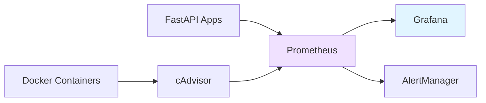

# 5. Monitorização

## Stack Implementada



---

## Componentes

### cAdvisor (porta 8080)
- Coleta métricas de containers: CPU, memória, rede, disco
- Expõe endpoint `/metrics` para Prometheus
- Interface web com visualização real-time

### Prometheus (porta 9090)
- Time-series database
- Scraping a cada 15s de:
  - cAdvisor (métricas containers)
  - FastAPI (métricas aplicação via `/metrics`)
- Query language (PromQL)

### Grafana (porta 3000)
- Dashboards de visualização
- Login: `admin/admin`
- Data source: Prometheus

### AlertManager (porta 9093)
- Gestão de alertas
- Regras configuradas em `prometheus-alerts.yml`

### Prometheus Instrumentator
- Integrado nas APIs FastAPI
- Métricas HTTP: request rate, latência, status codes
- Endpoint: `http://localhost/metrics`

---

## Configuração Prometheus

```yaml
global:
  scrape_interval: 15s

scrape_configs:
  - job_name: 'cadvisor'
    static_configs:
      - targets: ['cadvisor:8080']

  - job_name: 'um-drive-api'
    static_configs:
      - targets: 
          - 'um-drive-api-1:8000'
          - 'um-drive-api-2:8000'
          - 'um-drive-api-3:8000'
```

---

## Dashboards Grafana

### Setup Inicial
1. Add Data Source → Prometheus → URL: `http://prometheus:9090`
2. Import Dashboard ID `893` (Docker & System Monitoring)
3. Import Dashboard ID `14282` (cAdvisor Exporter)

### Métricas Principais

**Containers:**
- CPU usage por container
- Memória usage vs limites
- Network I/O (RX/TX)
- Disk I/O (reads/writes)
- Uptime

**Aplicação:**
- `http_requests_total` - Total requests por endpoint/método
- `http_request_duration_seconds` - Latência
- `http_request_size_bytes` - Tamanho requests
- `http_response_size_bytes` - Tamanho responses

---

## Queries PromQL Úteis

```promql
# CPU usage por container
rate(container_cpu_usage_seconds_total{name=~"um-drive-api.*"}[5m]) * 100

# Memória usage (MB)
container_memory_usage_bytes{name=~"um-drive-api.*"} / 1024 / 1024

# Request rate API
rate(http_requests_total[5m])

# Latência p95
histogram_quantile(0.95, rate(http_request_duration_seconds_bucket[5m]))
```

---

## Alerting

Regras configuradas em `prometheus-alerts.yml`:

```yaml
groups:
  - name: container_alerts
    rules:
      - alert: HighCPUUsage
        expr: rate(container_cpu_usage_seconds_total[5m]) > 0.8
        for: 5m
        
      - alert: HighMemoryUsage
        expr: container_memory_usage_bytes / container_spec_memory_limit_bytes > 0.9
        for: 5m
        
      - alert: ContainerDown
        expr: up == 0
        for: 1m
```

---

## Verificação

```bash
# Targets ativos
curl http://localhost:9090/api/v1/targets | jq '.data.activeTargets[] | {job, health}'

# Métricas API
curl http://localhost/metrics | grep http_requests_total

# Logs containers
docker logs prometheus
docker logs grafana
```

---

## Acesso aos Serviços

| Serviço | URL | Credenciais |
|---------|-----|-------------|
| cAdvisor | http://localhost:8080 | - |
| Prometheus | http://localhost:9090 | - |
| Grafana | http://localhost:3000 | admin/admin |
| AlertManager | http://localhost:9093 | - |
| API Metrics | http://localhost/metrics | - |