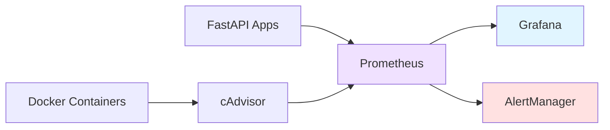

# 5. Monitorização

## Stack Implementada



---

## Componentes

### cAdvisor (porta 8080)
- Coleta métricas de containers: CPU, memória, rede, disco
- Expõe endpoint `/metrics` para Prometheus
- Interface web com visualização real-time

### Prometheus (porta 9090)
- Time-series database
- Scraping a cada 15s de:
  - cAdvisor (métricas containers)
  - FastAPI (métricas aplicação via `/metrics`)
- Query language (PromQL)
- Integração com AlertManager para gestão de alertas

### Grafana (porta 3000)
- Dashboards de visualização
- Login: `admin/admin`
- Data source: Prometheus
- 3 dashboards configuradas:
  - Dashboard 893 - Docker & System Monitoring
  - Dashboard 14282 - cAdvisor Exporter
  - UM Drive API - Complete Metrics (custom)

### AlertManager (porta 9093)
- Gestão e routing de alertas
- Configuração em `alertmanager.yml`
- Interface web para visualização de alertas ativos
- **7 alertas configurados:**
  - APIHighLatency
  - APIHighErrorRate
  - NoHealthyReplicas
  - HighCPUUsage
  - HighMemoryUsage
  - ContainerDown
  - DiskSpaceNFS

### Prometheus Instrumentator
- Integrado nas APIs FastAPI
- Métricas HTTP: request rate, latência, status codes
- Endpoint: `http://localhost/metrics` (via Traefik)
- Endpoints individuais:
  - `http://um-drive-api-1:8000/metrics`
  - `http://um-drive-api-2:8000/metrics`
  - `http://um-drive-api-3:8000/metrics`

---

## Configuração Prometheus

```yaml
global:
  scrape_interval: 15s
  evaluation_interval: 15s

alerting:
  alertmanagers:
    - static_configs:
        - targets: ['alertmanager:9093']

rule_files:
  - '/etc/prometheus/prometheus-alerts.yml'

scrape_configs:
  - job_name: 'cadvisor'
    static_configs:
      - targets: ['cadvisor:8080']

  - job_name: 'um-drive-api'
    static_configs:
      - targets: 
          - 'um-drive-api-1:8000'
          - 'um-drive-api-2:8000'
          - 'um-drive-api-3:8000'
```

---

## Rede Docker Unificada

**Todos os serviços estão na rede `um-drive-network`:**
- Comunicação interna por nome de serviço
- Prometheus consegue fazer scrape de todos os targets
- AlertManager acessível pelo Prometheus
- Isolamento de tráfego interno

**Benefícios:**
- Service discovery automático
- Sem necessidade de IPs fixos
- Melhor segurança (tráfego isolado)

---

## Dashboards Grafana

### Setup Inicial
1. Add Data Source → Prometheus → URL: `http://prometheus:9090`
2. Import Dashboard ID `893` (Docker & System Monitoring)
3. Import Dashboard ID `14282` (cAdvisor Exporter)
4. Import custom dashboard `UM Drive API - Complete Metrics`

### Métricas Principais

**Containers:**
- CPU usage por container
- Memória usage vs limites
- Network I/O (RX/TX)
- Disk I/O (reads/writes)
- Uptime e health status

**Aplicação (API):**
- `http_requests_total` - Total requests por endpoint/método
- `http_request_duration_seconds` - Latência (p50, p95, p99)
- `http_request_size_bytes` - Tamanho requests
- `http_response_size_bytes` - Tamanho responses
- CRUD operations breakdown (GET, POST, PUT, DELETE)

---

## Queries PromQL Úteis

```promql
# CPU usage por container
rate(container_cpu_usage_seconds_total{name=~"um-drive-api.*"}[5m]) * 100

# Memória usage (MB)
container_memory_usage_bytes{name=~"um-drive-api.*"} / 1024 / 1024

# Request rate total
sum(rate(http_requests_total[1m]))

# Request rate por método HTTP
sum(rate(http_requests_total[1m])) by (method)

# Latência p95
histogram_quantile(0.95, sum(rate(http_request_duration_seconds_bucket[1m])) by (le))

# Requests com erro
sum(rate(http_requests_total{status=~"4xx|5xx"}[5m]))

# Health status das réplicas
up{job="um-drive-api"}
```

---

## Alerting

### Regras Configuradas

**API Alerts (prometheus-alerts.yml):**
```yaml
- alert: APIHighLatency
  expr: histogram_quantile(0.95, sum(rate(http_request_duration_seconds_bucket[5m])) by (le)) > 1
  for: 5m
  annotations:
    summary: "API latency alta (p95 > 1s)"

- alert: APIHighErrorRate
  expr: sum(rate(http_requests_total{status=~"5xx"}[5m])) > 0.05
  for: 5m
  annotations:
    summary: "Taxa de erros 5xx elevada"

- alert: NoHealthyReplicas
  expr: count(up{job="um-drive-api"} == 1) < 2
  for: 2m
  annotations:
    summary: "Menos de 2 réplicas saudáveis"
```

**Container Alerts:**
```yaml
- alert: HighCPUUsage
  expr: rate(container_cpu_usage_seconds_total[5m]) > 0.8
  for: 5m

- alert: HighMemoryUsage
  expr: container_memory_usage_bytes / container_spec_memory_limit_bytes > 0.9
  for: 5m

- alert: ContainerDown
  expr: up == 0
  for: 1m
```

**Storage Alerts:**
```yaml
- alert: DiskSpaceNFS
  expr: (node_filesystem_avail_bytes{mountpoint="/mnt/nfs_share"} / node_filesystem_size_bytes{mountpoint="/mnt/nfs_share"}) < 0.1
  for: 5m
```

### Verificação de Alertas

```bash
# Ver alertas ativos no AlertManager
curl http://localhost:9093/api/v2/alerts

# Ver regras carregadas no Prometheus
curl http://localhost:9090/api/v1/rules

# Ver estado dos targets
curl http://localhost:9090/api/v1/targets | jq '.data.activeTargets[] | {job, health}'
```

---

## Health Checks

**Containers da API:**
- Endpoint: `GET /api/health`
- Intervalo: 30 segundos
- Timeout: 10 segundos
- Retries: 3
- Start period: 40 segundos

**Resposta esperada:**
```json
{
  "status": "healthy",
  "storage": "ok",
  "metadata": "ok"
}
```

**Verificação manual:**
```bash
# Health check direto
docker exec um-drive-api-1 curl http://localhost:8000/api/health

# Ver status dos containers
docker ps --format "table {{.Names}}\t{{.Status}}"
```

---

## Verificação

```bash
# Targets ativos no Prometheus
curl http://localhost:9090/api/v1/targets | jq '.data.activeTargets[] | {job, health}'

# Métricas da API
curl http://localhost/metrics | grep http_requests_total

# Verificar AlertManager
curl http://localhost:9093/api/v2/status

# Logs containers
docker logs prometheus
docker logs grafana
docker logs alertmanager

# Testar conectividade entre containers
docker exec prometheus wget -qO- http://cadvisor:8080/metrics
docker exec prometheus wget -qO- http://um-drive-api-1:8000/metrics
```

---

## Acesso aos Serviços

| Serviço | URL | Credenciais |
|---------|-----|-------------|
| cAdvisor | http://localhost:8080 | - |
| Prometheus | http://localhost:9090 | - |
| Grafana | http://localhost:3000 | admin/admin |
| AlertManager | http://localhost:9093 | - |
| API Metrics | http://localhost/metrics | - |
| API Health | http://localhost/api/health | - |

---

## Auto-Restart e Recuperação

**Configuração:**
- Todos os containers: `restart: always`
- Reiniciam automaticamente após falhas
- Persistem após reboot do host

**Teste de Recuperação:**
```bash
# Parar um container
docker stop um-drive-api-1

# Aguardar alerta no AlertManager (1-2 minutos)
# Container deve reiniciar automaticamente

# Verificar
docker ps | grep um-drive-api-1
```

**Ordem de arranque após reboot:**
1. Docker daemon inicia
2. Containers com `restart: always` sobem automaticamente
3. Health checks validam estado
4. Prometheus começa scraping
5. Alertas resolvem-se automaticamente