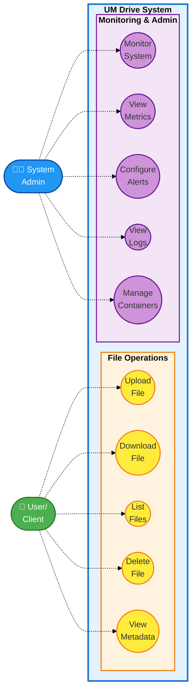
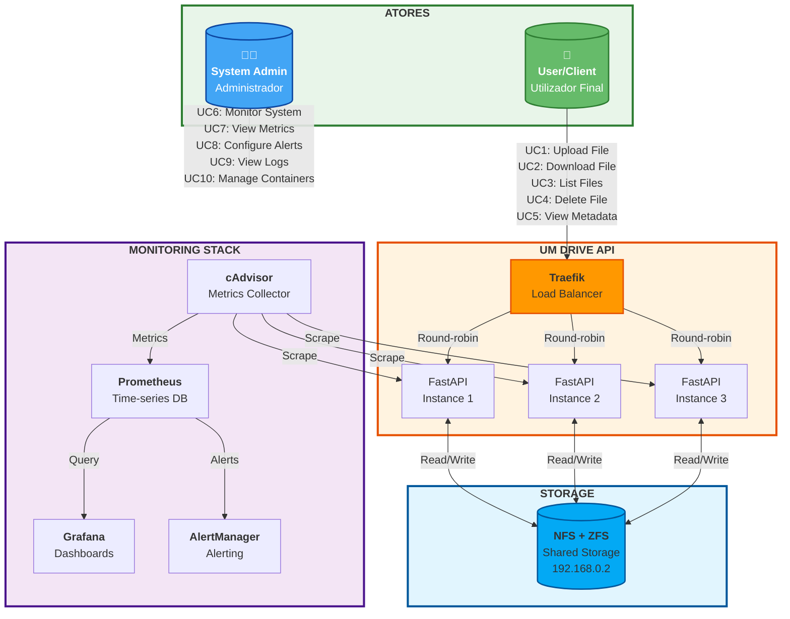
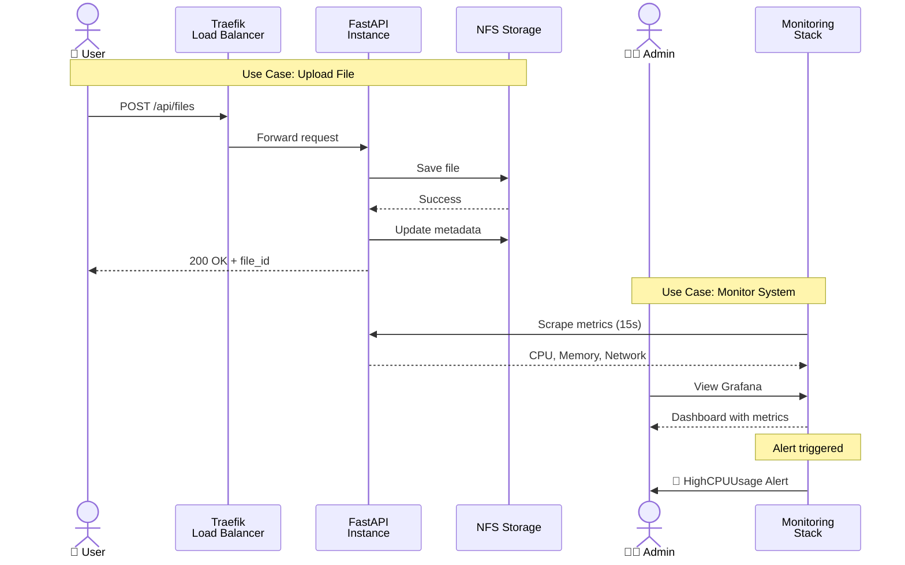
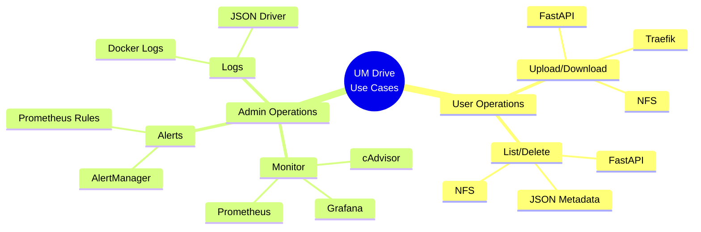

# Diagrama de Casos de Uso - UM Drive

## Use Case Diagram (UML)

---

## Diagrama de Arquitetura com Atores

---

## Casos de Uso Detalhados

### 👤 **User/Client Use Cases**

| ID | Nome | Descrição | Prioridade |
|----|------|-----------|------------|
| UC1 | Upload File | Fazer upload de ficheiros para o sistema | Alta |
| UC2 | Download File | Descarregar ficheiros armazenados | Alta |
| UC3 | List Files | Listar todos os ficheiros disponíveis | Média |
| UC4 | Delete File | Eliminar ficheiros do sistema | Média |
| UC5 | View Metadata | Consultar informações dos ficheiros | Baixa |

### 👨‍💼 **System Admin Use Cases**

| ID | Nome | Descrição | Prioridade |
|----|------|-----------|------------|
| UC6 | Monitor System | Monitorizar saúde do sistema em tempo real | Alta |
| UC7 | View Metrics | Visualizar métricas históricas e dashboards | Alta |
| UC8 | Configure Alerts | Gerir regras de alertas e notificações | Média |
| UC9 | View Logs | Consultar logs dos containers | Média |
| UC10 | Manage Containers | Iniciar/parar/reiniciar containers | Alta |

---

## Fluxo de Interação

---

## Matriz de Requisitos vs Use Cases

| Requisito | UC1 | UC2 | UC3 | UC4 | UC5 | UC6 | UC7 | UC8 | UC9 | UC10 |
|-----------|-----|-----|-----|-----|-----|-----|-----|-----|-----|------|
| **Escalabilidade** | ✅ | ✅ | ✅ | ✅ | ✅ | ✅ | - | - | - | ✅ |
| **Disponibilidade** | ✅ | ✅ | ✅ | ✅ | ✅ | ✅ | ✅ | ✅ | ✅ | ✅ |
| **Persistência** | ✅ | ✅ | ✅ | ✅ | ✅ | - | ✅ | ✅ | ✅ | - |
| **Observabilidade** | - | - | - | - | - | ✅ | ✅ | ✅ | ✅ | ✅ |
| **Load Balancing** | ✅ | ✅ | ✅ | ✅ | ✅ | - | - | - | - | - |
| **Monitorização** | ✅ | ✅ | ✅ | ✅ | ✅ | ✅ | ✅ | ✅ | ✅ | ✅ |

---

## Tecnologias por Use Case

