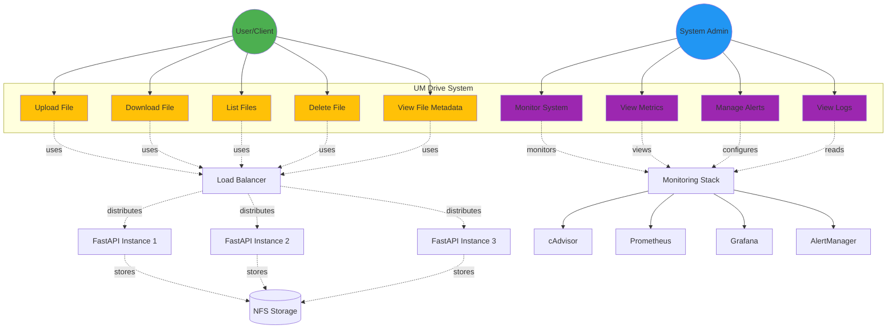

# Use Cases - UM Drive

## Diagrama de Casos de Uso

---

## Descrição dos Casos de Uso

### **User/Client Use Cases**

#### UC1: Upload File
- **Actor:** User
- **Descrição:** Utilizador faz upload de um ficheiro para o sistema
- **Pré-condições:** Sistema disponível
- **Fluxo Principal:**
  1. User envia ficheiro via POST /api/files
  2. Load balancer distribui para instância disponível
  3. FastAPI recebe ficheiro
  4. Ficheiro guardado em NFS
  5. Metadata atualizado em JSON
  6. Sistema retorna file_id
- **Pós-condições:** Ficheiro armazenado e acessível

#### UC2: Download File
- **Actor:** User
- **Descrição:** Utilizador faz download de um ficheiro existente
- **Pré-condições:** Ficheiro existe no sistema
- **Fluxo Principal:**
  1. User solicita GET /api/files/{file_id}
  2. Load balancer distribui pedido
  3. FastAPI lê ficheiro do NFS
  4. Sistema envia stream do ficheiro
- **Pós-condições:** Ficheiro transferido

#### UC3: List Files
- **Actor:** User
- **Descrição:** Utilizador lista todos os ficheiros disponíveis
- **Pré-condições:** Sistema disponível
- **Fluxo Principal:**
  1. User solicita GET /api/files
  2. Sistema lê metadata.json
  3. Retorna lista de ficheiros com metadados
- **Pós-condições:** Lista exibida

#### UC4: Delete File
- **Actor:** User
- **Descrição:** Utilizador elimina um ficheiro
- **Pré-condições:** Ficheiro existe
- **Fluxo Principal:**
  1. User solicita DELETE /api/files/{file_id}
  2. Sistema remove ficheiro do NFS
  3. Metadata atualizado
- **Pós-condições:** Ficheiro eliminado

#### UC5: View File Metadata
- **Actor:** User
- **Descrição:** Utilizador consulta informações de um ficheiro
- **Pré-condições:** Ficheiro existe
- **Fluxo Principal:**
  1. User acede metadata via API
  2. Sistema retorna: filename, size, upload_date, content_type
- **Pós-condições:** Metadados exibidos

---

### **System Admin Use Cases**

#### UC6: Monitor System
- **Actor:** System Admin
- **Descrição:** Administrador monitoriza saúde do sistema
- **Pré-condições:** Stack de monitorização ativa
- **Fluxo Principal:**
  1. Admin acede cAdvisor (port 8080)
  2. Visualiza métricas em tempo real
  3. Identifica possíveis problemas
- **Pós-condições:** Estado do sistema conhecido

#### UC7: View Metrics
- **Actor:** System Admin
- **Descrição:** Administrador visualiza métricas históricas
- **Pré-condições:** Prometheus e Grafana ativos
- **Fluxo Principal:**
  1. Admin acede Grafana (port 3000)
  2. Seleciona dashboard
  3. Analisa métricas: CPU, memória, rede, disco
  4. Identifica tendências e anomalias
- **Pós-condições:** Métricas analisadas

#### UC8: Manage Alerts
- **Actor:** System Admin
- **Descrição:** Administrador gere alertas do sistema
- **Pré-condições:** AlertManager configurado
- **Fluxo Principal:**
  1. Admin acede AlertManager (port 9093)
  2. Visualiza alertas ativos
  3. Configura silencing/inhibition
  4. Verifica notificações
- **Pós-condições:** Alertas geridos

#### UC9: View Logs
- **Actor:** System Admin
- **Descrição:** Administrador consulta logs dos containers
- **Pré-condições:** Containers em execução
- **Fluxo Principal:**
  1. Admin executa: `docker logs <container_name>`
  2. Filtra logs por severidade/timestamp
  3. Diagnostica erros
- **Pós-condições:** Problema identificado

---

## Atores

### User/Client
- **Descrição:** Utilizador final que interage com a API REST
- **Responsabilidades:**
  - Fazer upload de ficheiros
  - Descarregar ficheiros
  - Gerir os seus ficheiros

### System Admin
- **Descrição:** Administrador do sistema
- **Responsabilidades:**
  - Monitorizar saúde do sistema
  - Analisar métricas e logs
  - Gerir alertas
  - Garantir disponibilidade

---

## Relações entre Use Cases

### Includes (utiliza sempre)
- Upload/Download/List/Delete **include** Load Balancing
- Load Balancing **includes** Health Check
- Monitor System **includes** Collect Metrics

### Extends (pode estender)
- Delete File **extends** Update Metadata
- Upload File **extends** Validate File Type
- View Metrics **extends** Generate Report

---

## Fluxos Alternativos

### Upload File - Erro
1. Sistema sem espaço → retorna 507 Insufficient Storage
2. Ficheiro muito grande → retorna 413 Payload Too Large
3. NFS indisponível → retorna 503 Service Unavailable

### Download File - Erro
1. File_id não existe → retorna 404 Not Found
2. Ficheiro corrompido → retorna 500 Internal Server Error

### Monitor System - Alerta
1. CPU > 80% → dispara HighCPUUsage alert
2. Container down → dispara ContainerDown alert (critical)
3. AlertManager envia notificação

---

## Requisitos Não-Funcionais Suportados

| Use Case | Escalabilidade | Disponibilidade | Observabilidade |
|----------|----------------|-----------------|-----------------|
| Upload/Download | 3 réplicas | Auto-restart | Métricas em tempo real |
| List/Delete | Load balancing | Health checks | Logs centralizados |
| Monitor | - | - | Dashboards + Alertas |

