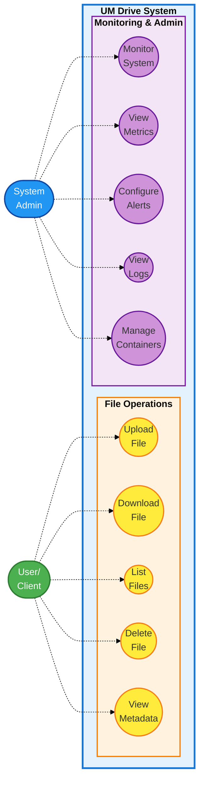
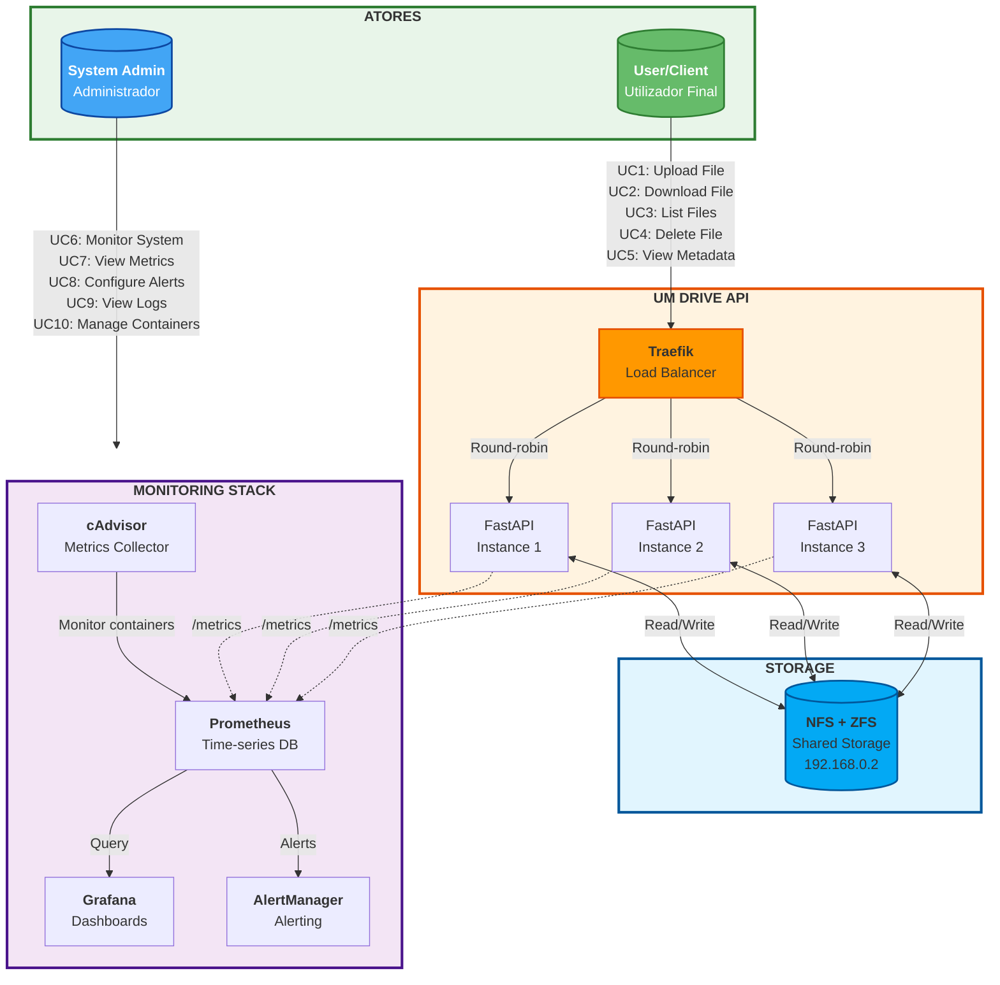
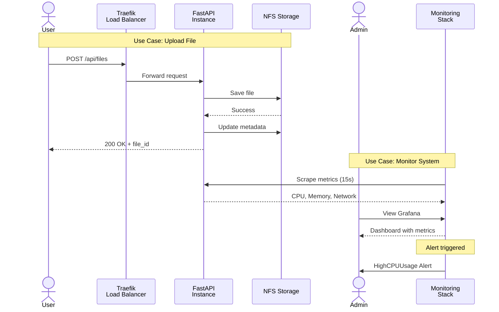
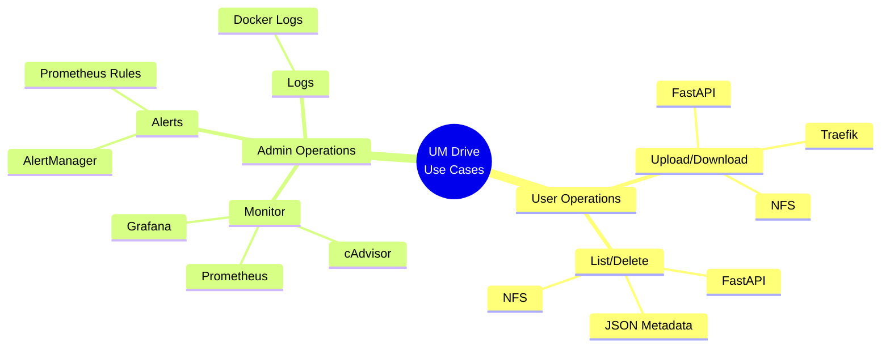

# Use Cases - UM Drive

## Use Case Diagram (UML)

---

## Diagrama de Arquitetura com Atores

---

## Fluxo de Interação

---

## Descrição dos Casos de Uso

### **User/Client Use Cases**

| ID | Nome | Descrição | Prioridade |
|----|------|-----------|------------|
| UC1 | Upload File | Fazer upload de ficheiros para o sistema | Alta |
| UC2 | Download File | Descarregar ficheiros armazenados | Alta |
| UC3 | List Files | Listar todos os ficheiros disponíveis | Média |
| UC4 | Delete File | Eliminar ficheiros do sistema | Média |
| UC5 | View Metadata | Consultar informações dos ficheiros | Baixa |

#### UC1: Upload File
- **Actor:** User
- **Pré-condições:** Sistema disponível
- **Fluxo Principal:**
  1. User envia ficheiro via POST /api/files
  2. Load balancer distribui para instância disponível
  3. FastAPI recebe e valida ficheiro
  4. Ficheiro guardado em NFS
  5. Metadata atualizado em JSON
  6. Sistema retorna file_id
- **Pós-condições:** Ficheiro armazenado e acessível
- **Fluxos Alternativos:**
  - Sistema sem espaço → 507 Insufficient Storage
  - NFS indisponível → 503 Service Unavailable

#### UC2: Download File
- **Actor:** User
- **Pré-condições:** Ficheiro existe no sistema
- **Fluxo Principal:**
  1. User solicita GET /api/files/{file_id}
  2. Load balancer distribui pedido
  3. FastAPI lê ficheiro do NFS
  4. Sistema envia stream do ficheiro
- **Pós-condições:** Ficheiro transferido
- **Fluxos Alternativos:**
  - File_id não existe → 404 Not Found
  - Ficheiro corrompido → 500 Internal Server Error

#### UC3: List Files
- **Actor:** User
- **Pré-condições:** Sistema disponível
- **Fluxo Principal:**
  1. User solicita GET /api/files
  2. Sistema lê metadata (SQLite)
  3. Retorna lista com metadados
- **Pós-condições:** Lista exibida

#### UC4: Delete File
- **Actor:** User
- **Pré-condições:** Ficheiro existe
- **Fluxo Principal:**
  1. User solicita DELETE /api/files/{file_id}
  2. Sistema remove ficheiro do NFS
  3. Metadata atualizado
- **Pós-condições:** Ficheiro eliminado

#### UC5: View File Metadata
- **Actor:** User
- **Pré-condições:** Ficheiro existe
- **Fluxo Principal:**
  1. User acede metadata via API
  2. Sistema retorna: id, filename, size, upload_date, content_type
- **Pós-condições:** Metadados exibidos

---

### **System Admin Use Cases**

| ID | Nome | Descrição | Prioridade |
|----|------|-----------|------------|
| UC6 | Monitor System | Monitorizar saúde do sistema em tempo real | Alta |
| UC7 | View Metrics | Visualizar métricas históricas e dashboards | Alta |
| UC8 | Configure Alerts | Gerir regras de alertas e notificações | Média |
| UC9 | View Logs | Consultar logs dos containers | Média |
| UC10 | Manage Containers | Iniciar/parar/reiniciar containers | Alta |

#### UC6: Monitor System
- **Actor:** System Admin
- **Pré-condições:** Stack de monitorização ativa
- **Fluxo Principal:**
  1. Admin acede cAdvisor (port 8080)
  2. Visualiza métricas em tempo real
  3. Identifica possíveis problemas
- **Pós-condições:** Estado do sistema conhecido

#### UC7: View Metrics
- **Actor:** System Admin
- **Pré-condições:** Prometheus e Grafana ativos
- **Fluxo Principal:**
  1. Admin acede Grafana (port 3000)
  2. Seleciona dashboard
  3. Analisa métricas: CPU, memória, rede, disco
  4. Identifica tendências e anomalias
- **Pós-condições:** Métricas analisadas

#### UC8: Manage Alerts
- **Actor:** System Admin
- **Pré-condições:** AlertManager configurado
- **Fluxo Principal:**
  1. Admin acede AlertManager (port 9093)
  2. Visualiza alertas ativos
  3. Configura silencing/inhibition
  4. Verifica notificações
- **Pós-condições:** Alertas geridos
- **Alertas Configurados:**
  - CPU > 80% → HighCPUUsage (warning)
  - Container down → ContainerDown (critical)

#### UC9: View Logs
- **Actor:** System Admin
- **Pré-condições:** Containers em execução
- **Fluxo Principal:**
  1. Admin executa: `docker logs <container_name>`
  2. Filtra logs por severidade/timestamp
  3. Diagnostica erros
- **Pós-condições:** Problema identificado

#### UC10: Manage Containers
- **Actor:** System Admin
- **Pré-condições:** Docker em execução
- **Fluxo Principal:**
  1. Admin executa comandos Docker
  2. Inicia/para/reinicia containers
  3. Verifica estado com `docker ps`
- **Pós-condições:** Containers geridos

---

## Matriz de Requisitos vs Use Cases

| Requisito | UC1 | UC2 | UC3 | UC4 | UC5 | UC6 | UC7 | UC8 | UC9 | UC10 |
|-----------|-----|-----|-----|-----|-----|-----|-----|-----|-----|------|
| **Escalabilidade** | ✅ | ✅ | ✅ | ✅ | ✅ | ✅ | - | - | - | ✅ |
| **Disponibilidade** | ✅ | ✅ | ✅ | ✅ | ✅ | ✅ | ✅ | ✅ | ✅ | ✅ |
| **Persistência** | ✅ | ✅ | ✅ | ✅ | ✅ | - | ✅ | ✅ | ✅ | - |
| **Observabilidade** | - | - | - | - | - | ✅ | ✅ | ✅ | ✅ | ✅ |
| **Load Balancing** | ✅ | ✅ | ✅ | ✅ | ✅ | - | - | - | - | - |
| **Monitorização** | ✅ | ✅ | ✅ | ✅ | ✅ | ✅ | ✅ | ✅ | ✅ | ✅ |

---

## Tecnologias por Use Case

---

## Relações entre Use Cases

### Includes (utiliza sempre)
- Upload/Download/List/Delete **include** Load Balancing
- Load Balancing **includes** Health Check
- Monitor System **includes** Collect Metrics

### Extends (pode estender)
- Delete File **extends** Update Metadata
- Upload File **extends** Validate File
- View Metrics **extends** Generate Report